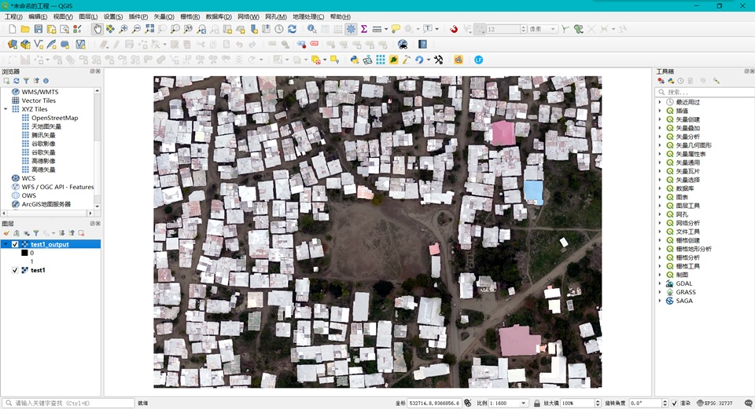
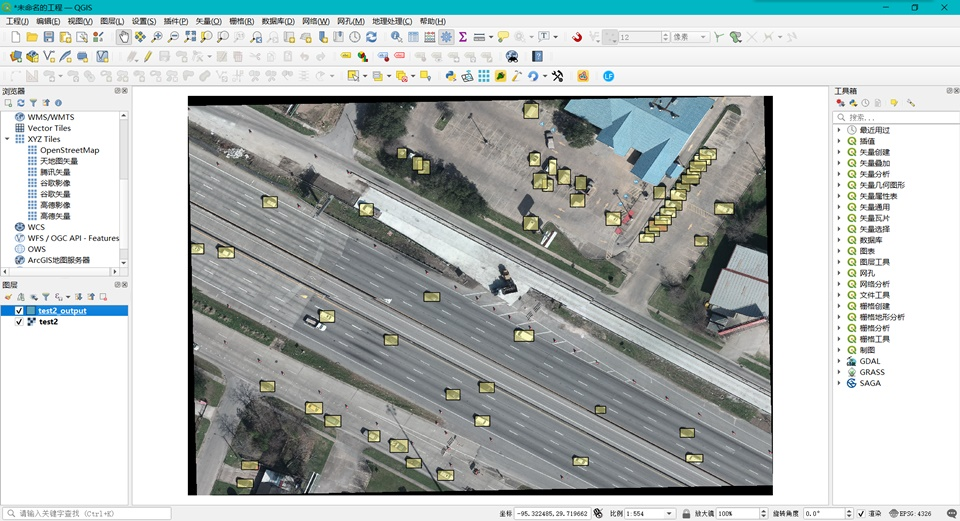

# SlideInfer

用于简单包装Paddle套件的模型，能够直接在训练完成的动态图模型上对遥感影像进行推理。目前完成了PaddleSeg的语义分割任务以及PaddleDetection的矩形框任务。

|          语义分割          |          目标检测          |
| :------------------------: | :------------------------: |
|  |  |
|   4983*3745  EPSG:32737    |    3735*2546  EPSG:4326    |

*\*注：目前仅支持Uint8的三通道影像（来自各类地图下载器的影像），目标检测图像坐标系统最好为EPSG:4326。*


## 如何使用

### PaddleSeg

可以通过pip安装paddleseg，以SegFormer\_B2为例，训练完成后可以按如下方式进行推理。结果将保存到与`tif_path`相同的路径，以`_output.tif`结束。保存结果可以在各类GIS软件中进行查看。

```python
import paddle
from paddleseg.models.segformer import SegFormer_B2
from sinfer import SegSlider

model = SegFormer_B2(num_classes=2)
model.set_dict(paddle.load(params_path))

# 转换为滑框推理模型
slide_model = SegSlider(model)
# # 可选，设置一些参数
# slide_model.ready(
#    block_size=512,
#    overlap=32,
#    mean=[0.5, 0.5, 0.5], 
#    std=[0.5, 0.5, 0.5]
# )
# 滑框推理
slide_model(tif_path)
```


### PaddleDetection

可以通过pip安装paddledet，PaddleDetectiond的模型直接使用不太方便，建议使用config进行加载，使用的什么config训练就可以仅加载该config对应的网络。以YOLOv3\_MobileNetv3\_large为例，训练完成后可以按如下方式进行推理。结果将保存到与`tif_path`相同的路径，以`_output.json`结束。保存结果可以在[这里](http://geojson.io/)进行查看（在线显示的坐标系统仅支持EPSG:4326），也可在各类GIS软件中进行查看。

```python
import paddle
from ppdet.core.workspace import load_config, create
from sinfer import DetSlider

cfg = load_config(config_path)
model = create(cfg.architecture)
model.set_state_dict(paddle.load(params_path))

# 转换为滑框推理模型
slide_model = DetSlider(model)
# # 可选，设置一些参数
# slide_model.ready(
#    draw_threshold=0.5,
#    block_size=608,
#    overlap=32,
#    mean=[0.485, 0.456, 0.406], 
#    std=[0.229, 0.224, 0.225]
# )
# 滑框推理
slide_model(tif_path)
```


## TODO

- [x] 语义分割（保存格式：geotiff）
- [x] 矩形框识别（保存格式：geojson）
- [ ] 场景分类（保存格式：geotiff）
- [ ] 图像超分（保存格式：geotiff）
